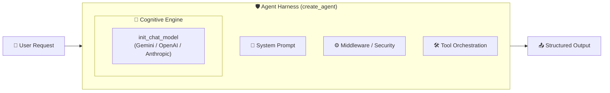

# 🔌 Lesson 1: Connect & Harness


## Connecting the Cognitive Engine to the Execution Chassis

[](https://colab.research.google.com/github/RACPSC2025/langchain-agent-harness-2026/blob/main/01-connect/lesson_1_connect.ipynb)
[](https://github.com/RACPSC2025/langchain-agent-harness-2026/issues)
[]()
[]()

### 🌐 Course Navigation

| **Previous Module** | **Current Lesson** | **Next Lesson** |
|---------------------|--------------------|-----------------|
| [🏠 Course Overview](../../README.md) | **📍 Lesson 1: Connect & Harness** | [⏩ Lesson 2: Tools & The LLM Contract](../02-tools/lesson_2_tools_en.md) |

---

## 🏗️ The "Agent Harness" Paradigm

In modern AI application development, architecture has evolved from simple code "wrappers" to the concept of the **Agent Harness**.

$$\text{Agent} = \text{Model} + \text{Harness}$$

Technically, a **Harness** is the infrastructure, execution environment, and control system that wraps around the LLM's inference cycle (the model loop). While the LLM functions as an isolated *cognitive engine*, the harness acts as the *chassis and operating system* that allows it to interact safely, structurally, and autonomously with the real world.



### 🎯 Engineering Layers in the Current Ecosystem

LLM software development is divided into three concentric levels of engineering:

1. **Prompt Engineering:** Designing the exact text instructions the model receives.
2. **Context Engineering:** Managing what specific data the model sees in its context window and when it sees it.
3. **Harness Engineering (Current Focus):** Encompasses the previous two and adds tool orchestration (Tool Calling), state persistence (memory), error management, verification loops, and system security.

---

## ⚡ 1. Basic Connection with `create_agent`

To run the harness, install the minimal packages and initialize the pure conversational harness:

```python
%pip install -U langchain "langchain[google-genai]"

```

```python OpenAI theme={"theme":{"light":"catppuccin-latte","dark":"catppuccin-mocha"}}
import os
from langchain.agents import create_agent
from google.colab import userdata

# Fetch API_KEY securely
os.environ["GEMINI_API_KEY"] = userdata.get('GEMINI_API_KEY')

# 1. Initialize the pure conversational harness
agent = create_agent(
    model="google_genai:gemini-3.6-flash",
    system_prompt="You are an expert Artificial Intelligence tutor. Provide concise and clear explanations. Answer in English.",
)

# 2. Execute by passing the conversation state
result = agent.invoke({
    "messages": [
        {"role": "user", "content": "Explain what an 'Agent Harness' is in one sentence."}
    ]
})

# 3. Inspect Output
last_message = result["messages"][-1]
print(f"AI 🤖: {last_message.content[0].get('text', '')}")

```

---

## 🎛️ Structural vs. Cognitive Parameters

In modern LangChain architecture, `create_agent` separates structural harness configurations from model hyperparameters:

### 1. Structural Parameters (Directly in `create_agent`)

* **`model`** (`str` | `BaseChatModel`): The unique identifier (e.g., `"google_genai:gemini-3.6-flash"`).
* **`system_prompt`** (`str` | `SystemMessage`): Defines system rules, role, constraints, and response language.
* **`tools`** (`list[Callable | BaseTool]`): List of native Python functions the agent can invoke.
* **`response_format`** (`BaseModel` | `TypedDict`): Forces structured JSON output matching a schema.
* **`middleware`** (`list`): Interceptors for cost audit, safety checks, or state modification.

### 2. Cognitive Hyperparameters (`temperature`, `max_tokens`, `max_retries`)

| Parameter | Where is it configured? | Type | What does it control in the Agent? |
| --- | --- | --- | --- |
| `system_prompt` | `create_agent` | String | Personality, role, boundaries, and base language. |
| `response_format` | `create_agent` | Pydantic Class | Forces structured responses (schema-valid JSON). |
| `temperature` | Model Instance | Float (0 to 1) | Randomness: `0.1` for code/data, `0.8` for creative chat. |
| `max_tokens` | Model Instance | Integer | Maximum allowed output token length. |
| `max_retries` | Model Instance | Integer | Automatic network retry attempts on failure. |

---

## 🚀 Hyperparameter Configuration Methods

### Method A: Direct Integration Class (For Local Scripts)

Requires `langchain-google-genai`:

```python Anthropic theme={"theme":{"light":"catppuccin-latte","dark":"catppuccin-mocha"}}
from langchain_google_genai import ChatGoogleGenerativeAI
from langchain.agents import create_agent

custom_model = ChatGoogleGenerativeAI(
    model="gemini-3.6-flash",
    max_tokens=500,
    max_retries=3
)

agent = create_agent(
    model=custom_model,
    system_prompt="You are an expert AI tutor. Provide concise explanations.",
)

```

### Method B: Universal Initializer `init_chat_model` (Production Standard)

In production, instantiating classes directly couples your codebase to a single provider. Using `init_chat_model` keeps your application **Model Agnostic**:

```python
import os
from langchain.chat_models import init_chat_model
from langchain.agents import create_agent

# 1. The Motor (Configured globally, model-agnostic)
production_model = init_chat_model(
    model=os.getenv("GEMINI_MODEL_NAME", "google_genai:gemini-3.6-flash"),
    temperature=0.3,
    max_retries=5,
    timeout=60,
)

# 2. The Harness (Fuses engine into execution chassis)
agent = create_agent(
    model=production_model,
    system_prompt="You are an expert AI tutor. Respond in English.",
)

response = agent.invoke({
    "messages": [{"role": "user", "content": "Explain what an 'Agent Harness' is."}]
})

print(f"AI 🤖: {response['messages'][-1].content}")

```

---

## 🔍 Engine vs. Chassis Breakdown

| Feature | `init_chat_model` (LLM Only) | `create_agent` (Harness) | The Combination (Production) |
| --- | --- | --- | --- |
| **Handles Tools automatically?** | ❌ No (Requires manual loop) | ✅ Yes | ✅ Yes |
| **Supports State / Memory?** | ❌ No | ✅ Yes | ✅ Yes |
| **Provider Agnostic?** | ✅ Yes (Via strings) | ❌ No (If using direct class) | ✅ **Maximum Flexibility** |
| **Main Purpose** | Clean initialization of the LLM. | Management of execution flow and rules. | **The Ultimate Production Standard.** |

---

## 💻 Execute in Google Colab

[👉 **Launch the Colab Notebook for Lesson 1 directly from GitHub](https://github.com/RACPSC2025/langchain-agent-harness-2026/blob/main/src/en/lesson_1_connect_en.ipynb)**

```

```
