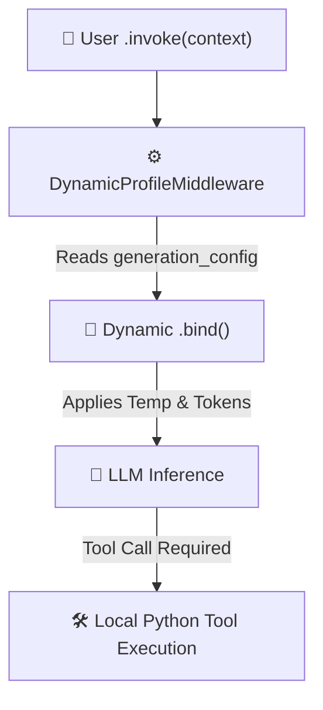

# 🛠️ Lesson 2: Tools & The LLM Contract


## Giving hands and eyes to our cognitive engine

[](https://colab.research.google.com/github/RACPSC2025/langchain-agent-harness-2026/blob/main/02-tools/lesson_2_tools.ipynb)
[](https://github.com/RACPSC2025/langchain-agent-harness-2026/issues)
[]()
[]()

### 🌐 Course Navigation

| **Previous Lesson** | **Current Lesson** | **Next Lesson** |
|---------------------|--------------------|-----------------|
| [⏪ Lesson 1: Connect & Harness](../01-connect/lesson_1_connect.md) | **📍 Lesson 2: Tools & Tool Calling** | [⏩ Lesson 3: Advanced APIs & Loops](../03-advanced-tools/lesson_3_advanced.md) |

---

## 🧠 Execution Flow & Middleware Architecture

When invoking the harness with dynamic middleware, the execution follows this lifecycle:



## 🌱 Getting Started
In the previous lesson, we built an isolated **Agent Harness**. It could think, but it couldn't interact with the real world. An agent without tools relies entirely on its pre-trained data, which can be outdated or insufficient for specific tasks.

**Agent = Large Language Model (Brain) + Harness (Skeleton) + Tools (Hands/Eyes)**

This lesson introduces **Tool Calling**—the mechanism that allows an LLM to request data from external systems, run Python code, or query databases.

> **🛑 THE BIGGEST MYTH IN AI AGENTS**
> 
> A common misconception is that the LLM executes Python code directly in the background. **It does not.** 
> The LLM acts purely as a **decision engine**. It reads your prompt, realizes it needs more information, and outputs a structured JSON response requesting a specific tool. Your local environment (the Harness) executes the code and hands the result back to the LLM.

---

## 🗃️ Lesson Breakdown

| **Topic** | **Description** | **Key Function / Concept** |
|-----------|-----------------|----------------------------|
| **The LLM Contract** | Understanding how docstrings become the prompt | `@tool` decorator |
| **Building a Tool** | Writing a robust Python function for the LLM | `def get_current_weather():` |
| **The Autonomous Loop**| Tracing the JSON execution flow | `ToolMessage` injection |

---

## 🏗️ Building Your First Tool

The modern standard for providing tools to an agent is using the `@tool` decorator. 

To make a tool effective, you must follow two strict rules to fulfill the **LLM Contract**:
1. **Precise Type Hints:** Tell the model exactly what data types to send (e.g., `city: str`).
2. **Descriptive Docstrings:** This is your tool's "sales pitch". If the LLM doesn't understand *when* or *how* to use it, it will hallucinate or ignore it.

```python
from langchain.tools import tool

@tool
def get_current_weather(city: str) -> str:
    """
    Get the current weather conditions for a specific city.
    
    Use this tool ONLY when the user explicitly asks about:
    - Current weather conditions
    - Temperature, humidity, or wind speed
    """
    # Simulated weather logic
    return f"The weather in {city} is currently 72°F and sunny."
```

## 🔄 The Tool Calling Loop in Action

When you bind this tool to your agent, the following sequence occurs completely autonomously:

1. 🗣️ **User Request:** *"Do I need an umbrella in New York today?"*
2. 🧠 **LLM Decision:** The model detects a knowledge gap and triggers `get_current_weather`.
3. 🛠️ **JSON Request:** Model outputs `{"name": "get_current_weather", "args": {"city": "New York"}}`.
4. ⚙️ **Local Execution:** Your Python script runs the function.
5. 📥 **State Update:** The result is appended to the conversation history as a `ToolMessage`.
6. 🤖 **Final Synthesis:** The LLM reads the result and replies: *"No umbrella needed! It's 72°F and sunny in New York."*

---

## 🚀 Time to Code

Theory is great, but seeing the trace logs in real-time is where it clicks. Let's jump into the interactive notebook to watch the LLM communicate with our Python functions.

[👉 **Launch the Colab Notebook for Lesson 2](https://colab.research.google.com/drive/1Rn69Sl1UVo9M6faPoBYds9_YIXpH3CtB#scrollTo=xCSD2beGhp9E)**

---

**Need Help?**
If you get stuck tracing the tool calls, review the LangChain debug logs or open an issue in the [course repository](https://www.google.com/url?sa=E&source=gmail&q=https://github.com/RACPSC2025/langchain-agent-harness-2026/issues). Happy coding!

```

---


